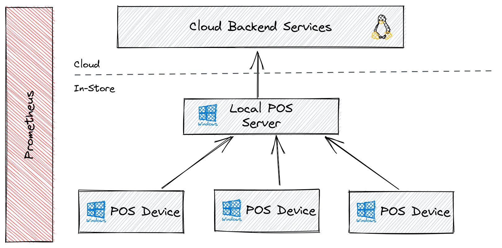

= Monitoring POS Infrastructure
with Prometheus and Netbox

[.notes]
--
* POS stands for Point of sales or point of contact. 
* Cash desk infrastructure
--

:revealjs_theme: white
:customcss: custom.css
:revealjs_history: true
:icons: font
:revealjs_totalTime: 900

== Felix Peters

[.notes]
--
* Internal platform team 
* Responsible for Linux and cloud base infrastructure 
--

Engineering Lead - Operations Core Tooling +

image::https://www.e-breuninger.de/fileadmin/Mediendatenbank/ALTE%20Website_vor%20dem%2011.9.13/Presse/Foto_und_Medienservice/Logos/Logo_Breuninger_URL_4c_Schwarz.jpg[width=320]

== Starting Point

[.notes]
--
* Store in munich since this year
* There was a demand for more insight about what's going on in the POS system. 
* Prometheus was the natal choice for us
* We already hav experience in running it and in writing alerts
--

* https://de.wikipedia.org/wiki/Breuninger[Breuninger] has multiple luxury fashion stores in Germany
* For 2020 it was announced that there will be a new POS system
* The old one was only monitored with ping checks in PRTG
* My Team should support the project

[CAUTION,step=1]
**We already have and love Prometheus!**

== POS System Overview

[.notes]
--
* The new system is build in layers. Linux based cloud instance as centralized backend service.
* Storing all the sales data in a cloud database.
** Easy to integrate with prometheus (node exporter and cloud based SD)
** We won't care too much about it today. 

* For each store we have a local server backend (master) which replicate data from the stores to the cloud.
** This backend is running on virtualize windows server instances with static ip config. 
* On each cash desk we have have a Windows desktop system running the POS software
** Sends processed data to the master instance
** Can have payment terminals and printers
--

// Monitoring cloud native workloads is easy. Everything which is billable has an API.
// But in a on premise world there is no native API. 

[.columns.is-vcentered]
== POS Device Architecture

[.notes]
--
The actual cash registers are windows based desktop systems in an appropriate design
and other peripherals such as card terminals and receipt printers. 
--

[.column]
--
* Windows based desktop systems
** _Metrics via https://github.com/prometheus-community/windows_exporter[windows_exporter]_
* Running Java based POS application
** _Custom exporter on Powershell_
** _Planned: https://github.com/prometheus/jmx_exporter[JMX exporter]_
* Peripherals like payment terminals
** _Metrics via https://github.com/prometheus/blackbox_exporter[Blackbox Exporter]_
--

[.column.is-one-quarter]
image::https://image.jimcdn.com/app/cms/image/transf/none/path/s7bf4e56cafb0dc16/image/i43a9024ac681ae25/version/1568976184/image.jpg[]

== Service Discovery

[.notes]
--
* In fact, it's a dynamic system
* Not as fast as the cloud or K8S, but it has moving parts
--

--
* There is no API describing the the current known POS devices
** _This is the real world - no cloud native features available_
* POS devices are no static deployment
** _They can be out of service for maintenance_
** _There are systems that are only active when required_
--

[WARNING,step=2]
How does Prometheus know which POS systems are currently active?

[background-color="#a81326"]
== We need an inventory!

[.notes]
--
* What is online
* What is broken
* Reduce false alerts
* Where are devices located
* How should be paged in case of an error
--

== Introducing Netbox

[.notes]
--
* The Answer is Netbox! 
* **Survey: Who knows Netbox?**

* Developed at Digital Ocean
* Currently supported by NS1.
* No more Excel sheets
* Structured data about the network and devices
--

image:https://raw.githubusercontent.com/netbox-community/netbox/develop/docs/netbox_logo.svg[width=150]

--
* Python based web application for IP address management *(IPAM)* and Datacenter infrastructure management *(DCIM)*
* Capable of managing *devices* and *virtual machine's life cycle*.
* Powerful **APIs** and **extensions**
--

[CAUTION, step=1]
NetBox provides the "source of truth" to power automation

== Connecting Netbox with Prometheus

[.notes]
--
* We want to have a cloud native feeling for real world infrastructure
* Excel and manual adjustments in files are not an option!
* Labels for routing and alerts
--

* Goal: Dynamic configuration of Prometheus targets via Netbox
* Bonus: Apply Netbox content to Prometheus labels

[WARNING, step=1]
There is no native integration of Netbox and Prometheus

[step=1]
__but we have some options...__

== `static_config`

[.notes]
--
* Classic approach for third party SD
* Scrape targets periodically and dump them to a file
--

__The classic approach__

* 👍 Easy to implement as a sidecar
* 👍 No adjustments on Netbox

* 👎 New component on each Prometheus
* 👎 Requires multiple API calls for each device
* 👎 Requires additional monitoring of the sidecar

[step=1]
https://github.com/FlxPeters/netbox-prometheus-sd

== `http_sd`

[.notes]
--
* Modern way of integration with third party SD sources
* Move the knowledge back to the source
* Just a new view on the Netbox API
--

__Fetch targets dynamically via HTTP__

https://prometheus.io/docs/prometheus/latest/http_sd/#comparison-between-file-based-sd-and-http-sd[Introduced] in Prometheus 2.28.0 as alternative to `static_config`

* 👍 No sidecar on Prometheus
* 👍 Full power of the Netbox API (filters etc.)
* 👍 No replicated filter flags on the sidecar
* 👍 Less API calls

* 👎 Requires adjustments/plugin on Netbox

[step=1]
https://github.com/FlxPeters/netbox-plugin-prometheus-sd

== Demo

== Conclusion

* Netbox and Prometheus are a perfect match for monitoring targets without a cloud native API or inventory
* Not only useable for POS devices - also for network devices and bare metal infrastructure

== Bonus

TIP: Give the Engineers a reason to document: +
     By coupling documentation and monitoring, we always have up-to-date and maintained documentation of the environment.

== Questions?